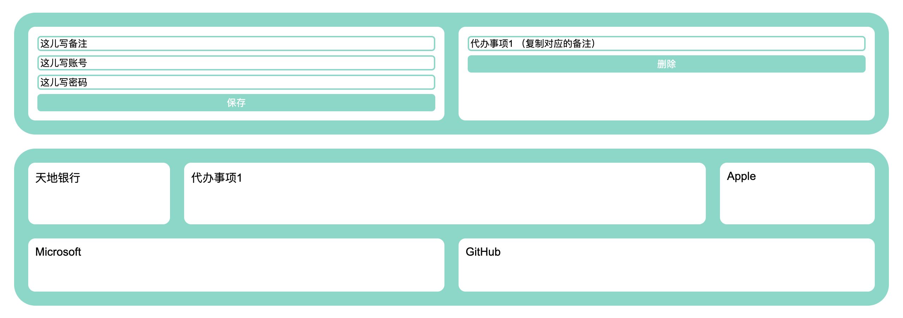
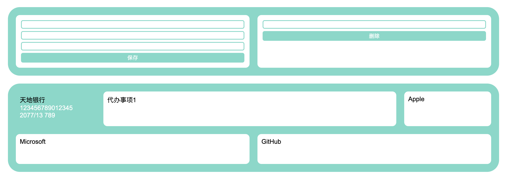
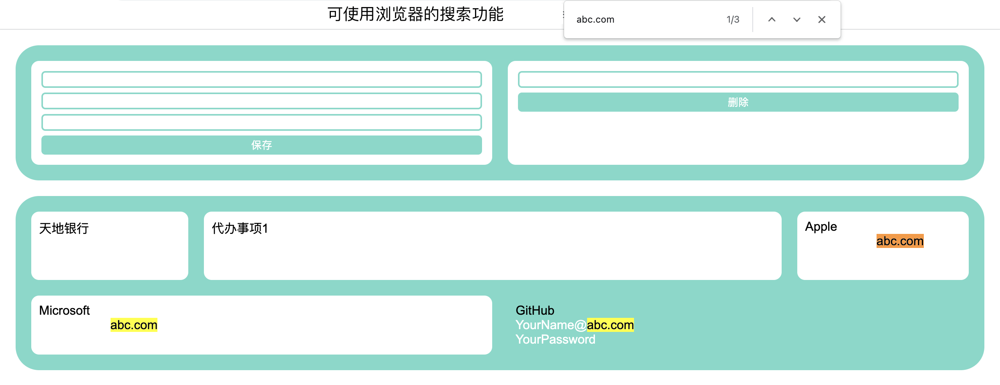

# BaisiPasswordManager 白肆密码管理器
一个私有化部署的密码记录网站

# 演示



也支持移动端

# 下载
### GitHub Release
[链接](https://github.com/BaisiTech/BaisiPasswordManager/releases)
### 备用下载
[压缩分包1/2](https://main.download.baisi.tech/BaisiPasswordManager/BaisiPasswordManager.zip)  
[压缩分包2/2](https://main.download.baisi.tech/BaisiPasswordManager/BaisiPasswordManager.z01)

# 使用
（可自行创建启动脚本）
```
java -jar [你下载的jar文件]
```
访问 http://127.0.0.1:38400 即可

# 其他
### 储存
使用SQLite储存，在同级目录下生成“BaisiPassword.db”，可自行使用数据库软件查看。  
密码数据: password 表。  
网站密钥: user 表。  
删除数据库文件即可重置网站。  

### 网站密钥
密钥以cookie形式存储于浏览器中，初次打开会自动生成并添加一条密钥的记录，可根据提示赋予其他浏览器访问权限。

### 端口
默认使用38400端口。  
可修改 /src/main/resources/application.properties 后自行构建。
Gradle任务 -> Tasks -> build -> bootJar，在/build/libs中输出文件。

### 网络
使用http协议，可供内网访问。  
也可使用cloudflared等服务穿透至公网使用https协议。

### 测试环境
MacOS JDK17

